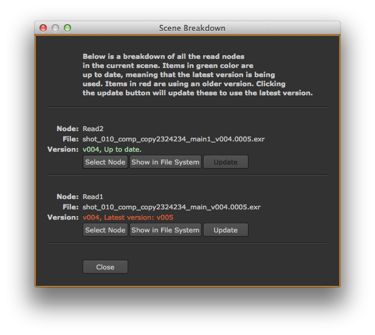

# Nuke Scene Breakdown

The Nuke Scene breakdown shows you a list of **scene inputs** and tells you which ones are 
out of date. You access it from the Tank Menu.

 

The breakdown UI shows all read nodes in the nuke scene that it recognises and provides a number
of different options for each read node:

* Clicking the **Select Node** button will select the node in Nuke and zoom into the node
  in the overview.
* Clicking **Show in File System** will launch a OS file system browser (finder, explorer, etc)
  and point it to the location of the input data.
* Clicking the **Update** button will change the input node's path so that it uses the latest
  version of the data available. This option is only available for nodes that are not up to date.
  
  
