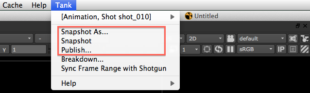
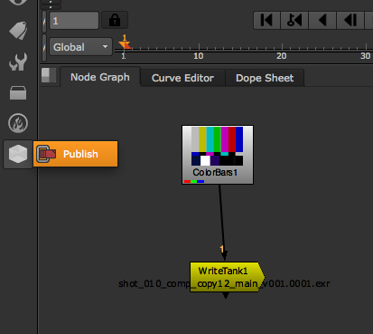
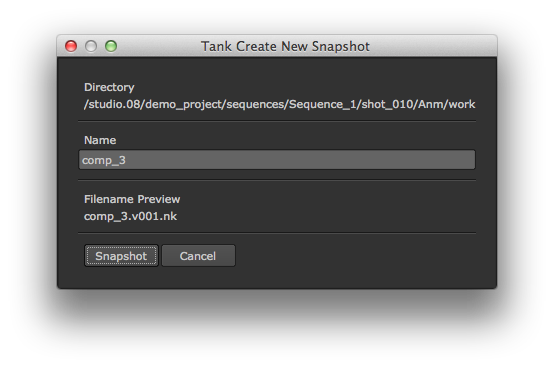
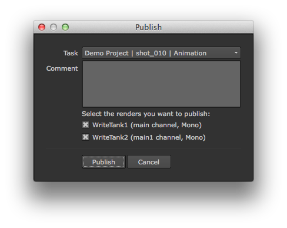
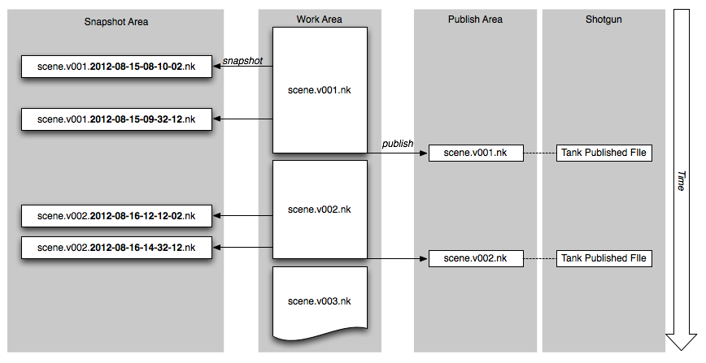
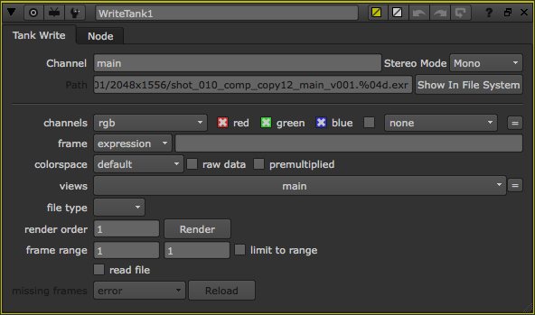

# Nuke Snapshot and Publish

The Nuke Snapshot and Publish App provides an easy and consistent way to save the nuke scene
that you are working on. The App will take care of versioning up your work and put it in the 
right place on the file system.

In addition to handling the actual nuke script, the app also provides a custom Write node
which makes it easy to standardize the location where things are rendered to.

You can access the Snapshot and publish functionality via the main menu:

 

You can access the Tank Write Node via the Node menu:

 

## When you are working

When you are working, Tank will help you determine the right location for your work file.
When you want to save your file to disk for the first time, do a **Snapshot As** (available from
the Tank menu). Tank will ask you for a file name and save a file named `name.v001.nk` for you
in the current work area:

 

You can now work as normal. When you want to save changes, just use the standard save in Nuke.

The problem with saving in Nuke is that sometimes it is difficult to go back to a previous state.
Say for example that you are about to delete a large part of your scene. Pressing save means that 
the content is gone and may or may not be recoverable using Undo. In that case it would be great 
if there was a way or creating a *backup* of your current work before you do that big delete,
just to be sure. We call this a *snapshot*. Snapshotting is quick and easy, very similar to a save.
When the file is snapshotted, tank will save it in a special snapshots folder and add a timestamp
to indicate when the snapshot was made. 

## When you want to share your work

Once you have been working on your content for a while and feel that it is time to share it,
Tank makes it easy to *Publish*. Publishing in Tank means simply sharing it with a larger audience.
Whether it is for review, downstream consumption or just to notify your team members about your 
progress, it is all called a publish.

 

When you publish, the current work file is transferred to a publish area. The same version number 
as the work file be used. After this, the current work file number will be incremented. One way 
of thinking about this workflow is that you work on a version until it is published. The publish
mark the end of that version number and immediately after the publish, a new version number is 
allocated to the current work file. The diagram below shows a time line and how snapshots, work 
files and publishes relate to each other:

 

Also note that a publish is registered in Shotgun and associated with the current task and 
entity. 

## Using Tank when rendering

In addition to just helping you save the nuke script in the right location, Tank also has a write
node which can be used if you want to render to a standard location.

In order to use the Tank Write node, snapshot your scene first, then create a new node via the 
Nuke nodes menu. This will create a node which looks similar to a normal write node:

 

The difference is that rather than entering a path by hand, you just specify a channel and Tank
will compute the rest of the path automatically. You can see the computed path in the UI and open
up the location on disk by clicking the *Show in File System* button. The location where the
renders are written to depends on the tank configuration.

The renders will be versioned and the version number always follows the current nuke script version.
This means that when you publish you nuke script, and therefore version up, all Tank Nodes will
automatically also version up.

