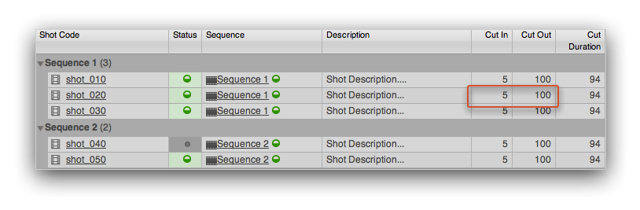

# Automatically setting the frame range

This app helps managing the frame range in your Nuke script. It currently only works 
with Shots. You can access it from the Tank menu by clicking the **Sync Frame
Range with Shotgun** menu option.

When you click it, Tank will look at the current shot and look for its in and out:

 

It will then update the current scene with those ins and outs and finally display a summary
message:

 
